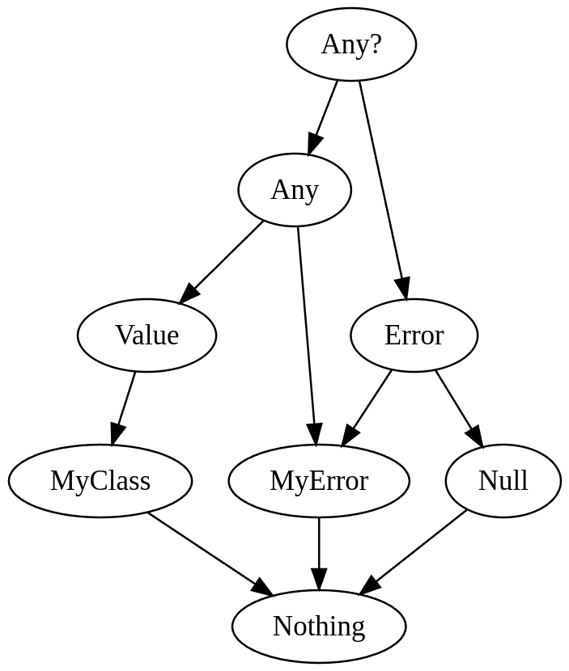

# Union Types for Errors
> TODO: discuss: another name (states or something)

* **Type**: Design proposal
* **Authors**: Roman Venediktov, Daniil Berezun
* **Contributors**: Marat Akhin, Mikhail Zarechenskiy
* **Status**: In research
* **Related YouTrack issue**: [KT-68296](https://youtrack.jetbrains.com/issue/KT-68296/Union-Types-for-Errors)

## Overview

This KEEP introduces *union error types*,
which allows for better handling of expected failure states for values and function results.

## Problem statement

### Motivation

#### ...OrThrow / ...OrNull

> TODO: discuss: What is the issue with only `orNull` version and !! usage? To agree on this requires for better understanding on expected conversions of errors to exceptions.

It's quite common to encounter functions that describe part of their effects for error cases in their names.
A typical example could be functions `maxOf` from the standard library
([code](https://github.com/JetBrains/kotlin/blob/0938b46726b9c6938df309098316ce741815bb55/libraries/stdlib/common/src/generated/_Arrays.kt#L14700))
where many of them are duplicated to have `maxOfOrNull` counterpart in case of empty collections.

> TODO: discuss: What was behind "It's quite common to encounter functions that describe part of their effects for error cases in their names."? Only orNull, orThrow? Or something more complex?
> 
> Next is written assuming that it is only about orNull and orThrow.

Both of them are useful in different cases. 
- When you are considering the case of an empty collection as an expected case,
  you would like to process it in a special, but concise way.
  Throwing version does not fit here because:
  - It requires boilerplate to catch the exception.
  - It implies runtime overhead.
  - It leads to complex control flow.
- When you are considering the case of an empty collection as an exceptional case,
  you would like to leave processing to your framework or to fail fast.
  Null version does not fit here because:
  - Bang-bang operator will lose the information about the specific error.

While it is possible to have both versions, it leads to duplication of code and declaration.
This could be solved by having a single function with a functional name like `max` or `processRequest`,
where exceptional cases are soundly encoded in the return type.
With the error union types, it could be written as follows:

```kotlin
// getOrThrow -> get
fun <T> get(): T | Error

// maxOrNull -> max
fun IntArray.max(): Int | NoSuchElement

// awaitSingleOrNull -> awaitSingle
fun <T> awaitSingle(): T | NoSuchElement
```

In this case programmer is able to handle them at the call site in both ways.
Either throw an exception using `!!` or process it in a special way using `when` expression and syntax sugar.

> Additionally, it allows having a more informative stack trace in these cases.
> As at the top of stack trace, there will be a place where the expectations of a programmer were violated, 
> not some internals of the library.

#### In-place tags

The other use-case of the error union types arises when we would like to track exceptional states inside our function or class.
A typical showcase is `Sequence.last` function that is written as follows:

```kotlin
inline fun <T> Sequence<T>.last(predicate: (T) -> Boolean): T {
    var last: T? = null
    var found = false
    for (element in this) {
        if (predicate(element)) {
            last = element
            found = true
        }
    }
    if (!found) throw NoSuchElementException("Sequence contains no element matching the predicate.")
    @Suppress("UNCHECKED_CAST")
    return last as T
}
```

The variable `found` is used specifically for cases when a predicate looks like `{ it == null }`. 
It's a typical pattern for functions that retrieve data from containers (`single`/`singleOrNull`/`last`/...).

One way to rewrite the code without using the variable `found` is to use some kind of private tag:

```kotlin
object NotFound

inline fun <T> Sequence<T>.last(predicate: (T) -> Boolean): T {
    var last: Any? = NotFound // We have to use the most common type Any?
    for (element in this) {
        if (predicate(element)) {
            last = element
        }
    }
    if (last == NotFound) throw NoSuchElementException("Sequence contains no element matching the predicate.")
    @Suppress("UNCHECKED_CAST")
    return last as T // unchecked cast
}
```

It might be a bit shorter, but we still have to trick our type system by using the most common type `Any?` 
and performing an unchecked cast at the end.

Combining the ideas of tags and unions, the mentioned code could be rewritten as follows:

```kotlin
error object NotFound

inline fun <T> Sequence<T>.last(predicate: (T) -> Boolean): T {
    var last: T | NotFound = NotFound
    for (element in this) {
        if (predicate(element)) {
            last = element
        }
    }
    if (last == NotFound) throw NoSuchElementException("Sequence contains no element matching the predicate.")
    return last // smart-cast to T
}
```

Our functions work for all `T` and it doesn't have unchecked casts.

To make this function fully correct, we have to prevent `NotFound` from leaking outside the function, 
so it will be impossible to pass a sequence with `NotFound` to this function, leading to an incorrect behavior.

```kotlin
inline fun <T> Sequence<T>.last(predicate: (T) -> Boolean): T {
    error object NotFound
    
    var last: T | NotFound = NotFound
    for (element in this) {
        if (predicate(element)) {
            last = element
        }
    }
    if (last == NotFound) throw NoSuchElementException("Sequence contains no element matching the predicate.")
    return last // smart-cast to T
}
```

The new implementation is better in several ways:
- It is more readable as it merged two variables with shared logic into one.
- It requires 2 lines less.
- It is type-safe as it does not require unchecked casts.

### Background

In this section, we discuss other approaches that could be used to solve the mentioned use-cases.

#### Either

`Either` is a common way to handle errors in functional programming languages.
It is parametrized with two types: one for the successful result and one for the error.
It has two constructors: `Left` and `Right` which are used to store the result and the error respectively.
In Kotlin, it is possible to implement `Either` using sealed classes:

```kotlin
sealed class Either<out L, out R>
data class Left<out L>(val error: L) : Either<L, Nothing>()
data class Right<out R>(val value: R) : Either<Nothing, R>()
```

To eliminate `Either` you could use common `when` expression:

```kotlin
val result: Either<Int, String> = ...
when (result) {
    is Left -> println("Error: ${result.error}")
    is Right -> println("Value: ${result.value}")
}
```

It is possible to implement `Either` on the language level with the same operators as proposed for error unions.
But this approach has several disadvantages:
- Composition of `Either` is sensitive to the structure and order:
  `Either<A, Either<B, C>>` is not the same as `Either<Either<A, B>, C>` or `Either<B, Either<A, C>>`.
  Which may lead to complications for subtyping and code refactoring or reordering.
- Error type in `Either` is a common type in a Kotlin type system.
  Consequently, if you would like to have several possible errors, you have to create a sealed hierarchy for them.
  And you will not be able to return a subset of this hierarchy by handling only a part of errors.
- Even with the introduction of arbitrary unions, due to expressiveness of common types, unions on them will be limited.
- `Either` implies performance overhead on boxing.

By resolving all of these issues, 
we came up with no-boxed one-level `Either` with specific kind of types allowed as errors.
Which is actually the same as proposed error unions.

#### Effects as error handling

Effects is another technique to handle errors.
While it is not widespread on the language level so far 
(experimental in Scala, OCaml) (despite coroutines in Kotlin is an effect system), 
it is actively researched and has a lot of libraries in most of languages.

> TODO: Better introduction

The idea is that functions may trigger some effects, which are handled by the respective handler at the callstack.
The difference with exceptions is that effects are:
- Type-safe, as all possible effects have to be handled.
- Allows continuing execution after the effect is handled.

Effects is a very promising technique that is actively researched and used in some languages.
They may even be implemented in Kotlin in future using coroutines and context parameters.
The good example of their adoption for OO language is [Scala's capabilities](https://docs.scala-lang.org/scala3/reference/experimental/cc.html).

But we state that their use-cases are different from the proposed feature.
While they are great to track some IO interactions and unrecoverable exceptions, 
they may be too complex to handle simple cases like function `last` or that user's age is not in the range.

#### Error union type in Zig

The most similar language feature to the proposed one is [error union types in Zig](https://ziglang.org/documentation/master/#Error-Union-Type).
Here is a brief overview of the feature:
- There are both nullable (optionals) and error union types in the language, and they are orthogonal.
- Error types are just tags without data, represented as integers at runtime.
- Errors may be either declared preliminary with the corresponding set:
    ```zig
    const FileOpenError = error{
        AccessDenied,
        OutOfMemory,
        FileNotFound,
    };
    // ...
    const err = FileOpenError.FileNotFound;
    ```
    or declared on the fly using `error` keyword:
    ```zig
    const err = error.FileNotFound;
    ```
- Equal names implies equality of errors:
  ```zig
  const FileOpenError = error{
      AccessDenied,
      OutOfMemory,
      FileNotFound,
  };
  const AllocationError = error{
      OutOfMemory,
  };
  // ...
  const err1 = FileOpenError.OutOfMemory;
  const err2 = AllocationError.OutOfMemory;
  const err3 = error.OutOfMemory;
  // err1 == err2 == err3
  ```
  While it is useful as it allows for a variable to be assigned to a type 
  with a wider set of errors without usage of fully qualified names.
  Probability of unintentional clash considered as an issue (but minor).
- Syntax for error unions:
  - ```zig
    FileOpenError!u64
    ```
    Any error from the set `FileOpenError` or `u64`.
  - ```zig
    error{FileOpenError, AllocationError}!u64
    ```
    `FileOpenError` or `AllocationError` or `u64`.
  - ```zig
    anyerror!u64
    ```
    Any error or `u64`.
  - ```zig
    !u64
    ```
    Error set for this variable or function return type has to be inferred.
- The most straightforward way to handle errors is to use special `if` statement:
  ```zig
  const result: FileOpenError!u64
  if (result) |value| {
      // u64 in variable value
  } else |err| {
      // FileOpenError in variable err
  }
  ```
  and combining with `switch` expression:
  ```zig
  const result: FileOpenError!u64
  if (result) |value| {
      // u64 in variable value
  } else |err| switch (err) {
      error.AccessDenied => // ...
      error.OutOfMemory => // ...
      error.FileNotFound => // ...
  }
  ```
- There are two special operators for error handling.
  - `catch`:
    ```zig
    fn foo() !u32 {
        // ...
    }
    // ...
    
    // Option without binding
    const v1 = foo() catch 42;
    
    // Option with binding
    const v2 = foo() catch |err| switch (err) {
        // ...
    };
    ```
    A form of elvis operator.
  - `try`:
    ```zig
    const v3 = try foo();
    ```
    A form of bang-bang operator.
    If `foo` returns an error, it will be returned from the current function as well.
- There is a possibility to trace error bubbling through the tyr calls at the callstack.
- There are no complex generics in Zig, so there is no possibility to have a variables in error types as well.
- There is a [proposal](https://github.com/ziglang/zig/issues/2647) for allowing content in errors, 
  which is still not implemented.
- In general, users love this feature and consider error handling in zig as one of the best.

### Goals

> TODO: remove a redundant section?

1. Cover mentioned use-cases.
2. Minimize boilerplate required to operate with errors to the same level as with nulls.
3. Minimize performance overhead.
   Preferably to have an errors without data with the performance comparable to `null`.

## Proposal

### Errors declaration

Error classifier is declared using a soft keyword `error`:

```kotlin
error class MyError(val code: Int)
```

While they have similar syntax to classes, they have two significant limitations:
- They may not have any super-classifiers.
- They may not have any generic parameters.

The only supertype for errors is `Error` which is a new synthetic type alike `Any`.
Also, there is a new type `Value` which is a supertype for all common (non-error) classes.

### Errors usage

Error types may be united with common types using `|` operator to form an error union type.

```kotlin
fun foo(val content: String | ConnectionError | DbError): Int | OtherError
```

There may be even no non-error type in the union:

```kotlin
fun logError(val error: ConnectionError | DbError)
```

Limitations on those types:
1. It may contain only one non-error type.
   And it has to be written in the leftmost position.
2. In the signature of the function, union of generic variables is only allowed if they are disjoint.
   For example:
   ```kotlin
   class C<E1 : Error> {
     error object MyError
   
     fun <T, V : Value, E2 : Error, E3 : Error, EDB: DbErrors, EP: ParseErrors> foo(
       arg1: T | MyError, // allowed
       arg2: V | MyError, // allowed
       arg3: V | EDB | EP, // allowed
       arg4: V | E2 | MyError, // allowed
       arg5: V | E1 | E2 | MyError, // allowed, as E1 is inferred before any call of this function
       arg6: V | E2 | E3, // not allowed as E2 and E3 are not disjoint
       arg7: T | E1, // not allowed as T and E1 are not disjoint (T may have error component)
       arg8: V | E2 | EDB, // not allowed as E2 and EDB are not disjoint
     )
   }
   ```
   > TODO: discuss: maybe prohibit it at all?
   > It may complicate something, while have no real use-cases.
   > We may introduce it when common unions will be introduced.
   > 
   > TODO: discuss: "as E1 is inferred before any call of this function" is it true?
   
More precisely:
1. It may contain an arbitrary number of variables representing sets of errors.
   For example, in the following code:
   ```kotlin
   class C<E1 : Error> {
     error object MyError
   
     fun <E2 : Error, E3 : Error> foo(
       arg1: Int | E1,
       arg2: Int | E2,
       arg3: Int | E3,
       arg4: Int | MyError,
     ) {
       val v = when (Random.nextInt(4)) {
         0 -> arg1
         1 -> arg2
         2 -> arg3
         3 -> arg4
       }
     }
   }
   ```
   inferred type of the variable `v` will be `Int | E1 | E2 | E3 | MyError`.

### Operating with errors 1

The most straightforward way to destruct error union is to use `when` expression:

```kotlin
fun foo(val content: String | ConnectionError | DbError) =
    when (content) {
        is String -> response(content)
        is ConnectionError -> {
            // Here content is smart-casted to ConnectionError
            // So you can access its properties
            logger.error("Connection error: ${content.code}")
        }
        is DbError -> logger.error("DB error: ${content.message}")
    }
```

> TODO: there is some issue with referring to `DbError` with name content.
> Maybe it is reason why other languages introduce two return values for error and value.
> IMO to store them in a single value much better, but maybe we need a syntax for creating a new name or inplace destruction could be enough.
> ```kotlin
> fun foo(val content: String | ConnectionError | DbError) =
>     when (content) {
>         is String -> response(content)
>         is err: ConnectionError -> logger.error("Connection error: ${err.code}")
>         is DbError(message) -> logger.error("DB error: ${message}")
>     }
> ```
> This issue is close to pattern matching

To simplify operating with errors, it may be useful to introduce several operators like for nulls.
Before introducing them, let's discuss relations between errors and null.

### `null` is the Error

`null` is another special value which is typed orthogonal to class hierarchy.
There already exists a special handling like smart casts, operators and not-null generic types.
If we would like to have these two features separately, 
we have to introduce whole new machinery not only in the compiler but also in the syntax.
It leads to different safe call operators for `null` and for errors.
What if we would like to make a safe call that filters out only errors, only nulls or both?
To cover all of these cases and all possible future interactions,
we have to cover quadratic number of operators and features.
Which complicates everything, the language readability, the compiler, the IDE, the documentation, etc.

In addition to this issue, 
`null` is actually often used as an only error that may happen in the function with explanation in the comment.
While it is a good idea to use descriptive error instead of `null` with this KEEP, 
migration of all use-site usages may be another issue.
While if we treat them in the same way, significantly fewer use-site modifications are required.

Another reason is that treating `null` as an error is more consistent with the language.
By preserving less similar categories, 
we simplify future code where `null` and more informative errors will be used in one value.
While it may provide some inconveniences in cases where `null` is used to make unboxed optional.
More precisely, for variable `spouse: Person | Null | DbError`, 
where `null` is used to represent the absence of spouse, 
operator `!!` will definitely have an unexpected behavior and `.?` also behaves not as expected in some cases.
This use-case still has workaround with `when` expression, and **we may consider a new operator for this case?**.

In terms of formal backward compatibility, this change is ok, 
as for all existing code behavior is not changed, 
while with an introduction of new errors in a standard library, 
either compilation will fail, 
or they will be swallowed together by operator `!!`.

### Subtyping of errors

Now, as we discussed relation of `null` and errors, we may fully examine their subtyping.
As were mentioned, together with error types, two new types are introduced: `Error` and `Value`, 
representing a common supertype for all error types and all non-error types respectively.
With this, we have a new subtype hierarchy:



More precisely:
1. `Any :> Value`
2. `Any? :> Error`
3. `Error` is a supertype for all errors.
4. `Any` is a supertype for all errors except `Null`.
5. `Value` is a supertype for all common classes.
6. `Nothing` is a subtype for all types.

> TODO: discuss: What do you think of this hacky hierarchy?
> 
> TODO: discuss: deprecation of `Any`? :) (Replace with `Top` =:= `Any?`)

### Operating with errors 2

As mentioned, all operators for nullable types become applicable for error types.

- Safe call operator. `?.`
  
  Now it expands into the following:
  ```kotlin
  val v2 = v1?.foo()
  // expands into
  val v2 = if (v1 is Error) v1 else v1.foo()
  ```
  
  So the errors in `v2` is a union of errors in `v1` and errors in `foo()`.
- Bang-bang operator. `!!`
  
  Now it expands into the following:
  ```kotlin
  val v2 = v1!!
  // expands into
  val v2 = 
    if (v1 is Error) {
      throw UnexpectedErrorException(v1)
    } else {
      v1
    }
  ```
- Elvis operator. `?:`
  
  It would be consistent to expand it into the following:
  ```kotlin
  val v2 = v1 ?: v3
  // expands into
  val v2 = if (v1 is Error) v3 else v1
  ```
  
  But the issue there is that errors will be aggressively swallowed.
  For instance, if a library introduces a new error, 
  all the previous code will silently continue to work, while it may not be expected.
  While good design here should imply a compilation error, which forces programmer to handle new error.
  
  So, it is decided to make it equivalent to function `elvis`, defined as follows:
  ```kotlin
  fun <T : Value, E : Error> elvis(v1: T | Null, v3: T | E): T | E = if (v1 is Null) v3 else v1
  ```
  So, elvis operator will be applicable only for values where there are only `Null` error.
  
  > TODO: in Zig it is swallowing: https://ziglang.org/documentation/master/#catch
  > 
  > TODO: discuss if we should filter out null even if there are other errors.
  > 
  > TODO: discuss if it encourages usage of `Null` instead of meaningful errors.
  > 
  > TODO: Maybe we should filter out any single error in elvis operator? (what about typealias?)

#### New operator

TODO: discuss section on meeting

> https://youtrack.jetbrains.com/issue/KT-68296/Union-Types-for-Errors#focus=Comments-27-9976626.0-0
> 
> Taking everything together, it seems like the boundary for pragmatism should be in defining these error unions and using them with existing constructs like the when statement without creating deconstructor syntactic sugar. While developers want to save lines when writing code, we spend 10 times more time reading code so we should prioritize clarity and obvious control flow over clever syntax.

It is fine to apply all existing operators to errors, but with errors we may often encounter the following pattern:

```kotlin
val v = when (val tmp = foo()) {
    is NetworkError -> TODO("Some code")
    is DbError | CacheError -> TODO("Some other code")
    is Error -> tmp // or `throw tmp`
    else -> tmp // Value
}
```

> The other workaround for new operator is optional + errors

It may be quite useful to introduce a syntax sugar over this pattern.
It is quite complex to find a good syntax for it.
Some options:

- No changes in language, just auxiliary function(s).
  Suboptions:
  - ```kotlin
    val v = foo()
        .on<NetworkError> { TODO("Some code") }
        .on<DbError | CacheError> { TODO("Some other code") }
        .throwOn<AuthError>()
    ```
    > It does not provide workaround for optional with errors
- No new syntax, just bind error in a new variable in elvis operator.
  Suboptions: 
  - Implicitly introduce a new variable with name `it` (or `err`).
    ```kotlin
    val v = foo() ?: when (it) {
        is NetworkError -> 0
        is DbError -> 1
        else -> throw it // or err
    }
    ```
    - Backward compatibility issue: there may be existing variables with name `it` or `err`.
    - Issue: no possibility to use another name.
  - Explicitly introduce a new variable.
    Possible syntaxes:
    - ```kotlin
      val v = foo() ?: when (val e) {
          is NetworkError -> 0
          is DbError -> 1
          else -> throw e
      }
      ```
    - ```kotlin
      val v = foo() ?: e -> when (e) {
          is NetworkError -> 0
          is DbError -> 1
          else -> throw e
      }
      ```
- New elvis-like operator that binds variable.
  ```kotlin
  val v = foo() ?| when (err) {
      is NetworkError -> 0
      is DbError -> 1
      else -> throw err // or it
  }
  ```
  ```kotlin
  val v = foo() ?| e -> when (e) {
      is NetworkError -> 0
      is DbError -> 1
      else -> throw e
  }
  ```
- Totally new operator to remove `when` subexpression.
    Suboptions:
    - ```kotlin
      val v = foo() ? { e ->
          is NetworkError -> 0
          is DbError -> 1
          else -> throw it
      }
      ```
    - ```kotlin
      val v = foo() ?| { e ->
          is NetworkError -> 0
          is DbError -> 1
          else -> throw it
      }
      ```
    - ```kotlin
      val v = foo() ?when (val e) {
          is NetworkError -> 0
          is DbError -> 1
          else -> throw it
      }
      ```
  - ```kotlin
        val v = foo() ?! when {
            is NetworkError -> 0
            is DbError -> 1
            else -> throw it
        }
    ```
  - ```kotlin
      val v = foo() !! {
          is NetworkError -> 0
          is DbError -> 1
      }
    ```
  - ```kotlin
      val v = foo() !! when {
          is NetworkError -> 0
          is DbError -> 1
          else -> throw it
      }
    ```
    
> We think that word `catch` should not be used as it is already used for exceptions.
> And we should not create mental relation between them.

### Runtime representation

All errors could be expressed (internally) with a single class:

```kotlin
class Error(val classifier: String, val content: Any?)
// or
class Error<T>(val classifier: String, val content: T)
```

- Classifier is not just a name of the error, but also a scope where it is declared.
  Any checks for errors could be performed using just string equality.
  And these strings even could be transformed into `.intern()` to reduce any comparison to reference equality.
- Content is null for errors without data.
- If there is some data, there are several options to store them.
  - If there is one field, we may store it directly.
  - If there are several fields, we may declare backed data class or store them in the array

  These options have to be discussed in the context of binary compatibility and performance.

With this approach and declaration of the error could be transformed into:
- For errors without data: just a val with the only instance of this error.
  This allows operating with this error as with `null`, because we are able to use reference equality.
  This case is actually transformed into "Another special value for reference with the performance comparable to null."
- For errors with data: constructing function or nothing if we would like to construct them in-place.

### Typing

TODO: this section is outdated. To rewrite, see "Notes on type inference" in "Notes.md".

#### Types

- New types: `Error` (supertype for all errors), `Value` (supertype for all common types)
- New type constructor: `A | B` (error union)

#### Well-formattedness

> do we need to variables in the error component at all? (even in not signature types)
> 
> do we need even two variables in different components (T | E)?
> 
> What is the use-case? What are the complications? Is it easily mapped to type inference?

`A | B` is well-formed if:
- `A` and `B` are well-formed
- `B <: Error`
- `B` does not contain 2 non-disjoint variables
  > It means that errors may have forms:
  > - List of explicitly written error constants (further denoted as `Errs`)
  > - `E | Errs`, where E is an unbounded error variable
  > - `E1 | E2 | E3 | Errs`, where `E1` and `E2` and `E3` are error variables with disjoint upper bounds.
      F.e. DbErrors, NetworkErrors, and CacheErrors
- Constant errors in `B` are disjoint

#### Operations

- `T|_v`
    - `T <: Value` => `T|_v = T`
    - `T <: Error` => `T|_v = Nothing`
    - `T = A | B` => `T|_v = A|_v`
- `T|_e`
    - `T <: Value` => `T|_e = Nothing`
    - `T <: Error` => `T|_e = T`
    - `T = A | B` => `T|_e = A|_e | B`
- For `T <: Error`: `[T]` -- interpret `T` as a set of classifiers

#### Subtyping

New axioms:
- `Any :> Error`
- `Error :> MyError` for all `MyError`
- `MyError :> Nothing`
- `Any :> Value`
- `A :> B | C <= A :> B & A :> C`
- `A | B :> C <= A|_v :> C|_v & [A|_e | B] \subset [C|_e]`

#### Inference

First idea is that we replace any flexible variable that is not subtype of `Value` or subtype of `Error` with two variables: `T|_v` and `T|_e`.

Then we have to figure out how to solve constraints on error variables where they are interpreted as sets.
Actually, we have a list of constraints on sets with kinds:
- `A \subset B`, where `A` and `B` are predefined sets or variables
- `A \union B \subset C`, where
    - `A` and `C` are predefined sets or variables
    - `B` is a predefined set

Simple algorithm:
- Start with empty sets for all variables
- Fix all constraints that are not satisfied by adding (minimal amount of) elements into sets

Have complexity around `O(T * log(T) * C)`, where
- `T` is a number of elements in all sets
- `C` is a number of constraints

Such approaches usually lead to complex error messages.
Possible solutions:
- As we incorporate constraints one by one, we know the first one that is not satisfied => we may provide a message for it
- If we drop all upper-bounding constraints,
  we will infer the smallest possible sets satisfying all lower-bounding constraints.
  Then we may just check if the resulting type is a subtype of the expected type and provide a message if not.

#### Backward compatibility with nullability

> TODO: review mapping, consider corner cases.
> It is actually interesting in terms of strange subtyping of `Any`

### Relation to other features

#### Smart casts

We have to add support for error unions in smart casts.
For example:

```kotlin
val v: Int | Error1 | Error2 = foo()
if (v is Error1) {
    v // Error1
} else {
    v // Int | Error2
}
``` 

It is straightforward to make a smart cast in a first branch.
Actually, it works almost the same as now.

While the second branch is more complicated as it does not have any analogues in the compiler for now.
While the semantics of it is quite clear: 
We have to exclude the checked type from the union 
(more precisely, exclude all union items that are subtypes of the checked type).

> For this case:
> ```kotlin
> val v: Int | E = foo()
> if (v is Error1) {
>   v // Error1
> } else {
>   v // Int | E
> }
> ```
> We do not want to infer something like `E \ Error1`.
> Because it will lead us to a more complicated system, resolution of which is subexponential, non-deterministic, 
> and it produces worse error messages.
> (see [Set-theoretic types](https://www.irif.fr/~gc/papers/set-theoretic-types-2022.pdf))
> 
> On the contrary, if we have something like:
> ```kotlin
> val t: T
> t!!
> ```
> We should smart-cast `t` to `T & Value`

## More examples of idiomatic code

TODO

## Extra considerations

### Mixing with value types

#### Kotlin's value types

Actually, everything is ok if this value class does not contain an error-able class.
Otherwise, it implies boxing of value class.

#### Valhalla's value types

TODO

### Abuse cases

Error types may be (ab)used as special values instead of errors.

For example, it may be used like this:

```kotlin
sealed interface Tree {
    object Leaf : Tree
    data class Node(val left: Tree, val right: Tree) : Tree
}

// replaced with:

class Node(...) 
error Leaf
typealias Tree = Node | Leaf

// or even 

error Leaf
error Node(...)
typealias Tree = Unit | Node | Leaf   
```

All these cases are considered as a misuse of the feature.
It looks impossible and impractical to prevent them so we have to rely on the developer's discipline.

## References

- [Marat's quip (April 11)](https://jetbrains.quip.com/fOg9A3IXwD4b/Restricted-union-types)

## Future possibilities

### Origin of errors

TODO: it is possible to bubble errors if they were called with some specific modifier?

> Actually IMO it should not be useful as Error is an expected result of the function. You should not be interested in where exactly `String` were not parsed into `Int`. 
> To bubble this value is the same as to bubble, where the return value became 7 instead of expected 42.

### Local error unions

Local error type is an error defined in a specific scope.
They express some exceptional state of the function/class that exists only in internal logic.
They are expected not to leave it neither on the type level nor on the value level.
They are declared in the same way as global errors but with visibility modifiers.

```kotlin
fun last() {
   error NotFound
}

class C {
   private error NotFound
}
```

It is straightforward to control their scope on the type level as it is the same as for the common local classes.

To track their scope on the value level, we declare them as not subtypes neither of `Error` nor of `Any`.
But we leave them as a supertype of `Nothing`.
Because of this, for every value that may contain this error, it has to be directly expressed in the type.
Thus, if a type is not exposed out of the declared scope, the value is not exposed either.

The issue with this approach is that we are not able to pass value with this error in any function.
Even if we would like to have a private function expected to accept such value as an argument,
we have to specify it explicitly.
And if we would like for this function to optionally accept this error, we have to write such a boilerplate:
```kotlin
private error MyError

private fun <T, LOCE : MyError> foo(v : T | LOCE): T | LOCE
```
As a result, any value with such errors has significantly limited usability.

The main use-case of local errors is `last` function.
It is possible to implement it using a common errors.
If we just limit the scope of the error on the type-level (common private error)
and developer will track that this error is not exposed outside the function.
But with local errors, it is possible to guarantee the correctness of non-exposure on the type level.

> Because of such limitedness of their applicability we may introduce another modifier (`local`) for local errors
> and use `private` modifier in a same way as for classes.

> To expand the applicability of this feature,
> we may introduce a common supertype for all errors plus all errors local to the current scope.
> F.e. `Error@last` which is a supertype of `Error` and errors local to class of `last` and `last` function itself.

> TODO: discuss if this feature really needed.
>
> IMO it is too complicated, not so useful and does not align with the other language.

### Richer type system for errors

TODO: Exclusions

TODO: more complex non-disjoint cases for variables (E1 : Error, E2 : DBError)

TODO?: `Err(v)` representing errors of variable(argument) `v`

TODO: `Int??` as a shorthand for `Int | Error` or `Int | $E`
